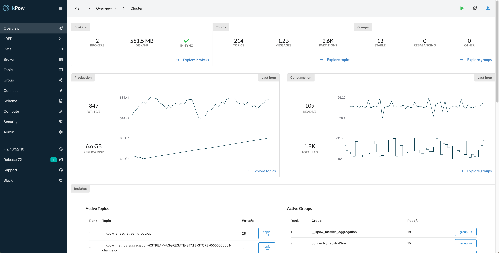

# [Kpow for Apache Kafka®](https://kpow.io)
[](https://github.com/operatr-io/kpow-docker/actions/workflows/release.yml)


## Evaluate locally with Docker Compose

The following steps will start a 3-node Kafka cluster on your machine with Docker Compose and connects the latest version of Kpow to that Kafka cluster with a 30-day trial licence that you have [obtained from our site](https://kpow.io/try/).

See our [User Guide](https://docs.kpow.io) for full documentation, this is the simplest configuration to get up and running in minutes.

## Kpow



## Prerequisites

* Install [docker-compose](https://docs.docker.com/compose/install/)
* A valid Kpow license (click [here](https://kpow.io/try/) for a 30-day trial)

## Instructions

The main folder of this repository contains a functional docker-compose.yml file. 

Run the application using it as shown below:

```bash
$ git clone https://github.com/factorhouse/kpow-local.git

$ cd kpow-local

$ vim local.env # Add your LICENSE details from Kpow Trial email here

$ docker-compose up
```

## Prometheus Integration

Email [sales@operatr.io](mailto:sales@operatr.io) to upgrade your trial license to a full one-month license and evaluate Kpow + Promethues.

Then edit local.env and set:

```
PROMETHEUS_EGRESS=true
```

### Notes

* Kpow's web UI is accessible on http://localhost:3000
* Prometheus web UI with scraped Kpow Metrics is accessible on http://localhost:9090/
* The Kafka brokers are accessible with bootstrap URL `127.0.0.1:9092,127.0.0.1:9093,127.0.0.1:9094` if you want to configure other services.

## Support

Any issues? Just [raise a ticket](https://github.com/factorhouse/kpow-local/issues) or view our [docs](https://docs.kpow.io).

Contact sales@factorhouse.io to upgrade your trial license to a fully featured 1-month Pro license if to evaluate User Authentication, Role Based Access Control, Data Policies, Prometheus Endpoints and more.

Looking to evaluate Kpow outside of Docker? Kpow will run with any Kafka Cluster from v1.0+ and is also [available as a JAR file](https://kpow.io/releases) for those without Dockerized environments.

## License

Copyright © Factor House 2021-2002.
